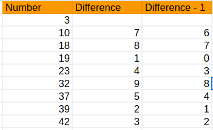

# Question 4: Tichu

## Explaination

### First Few Tasks

I solve these inputs manually by inserting them into spreadsheet and sort it.

### Next Few Tasks

I realised that the way to approach this is by finding the longest continuous difference-1 with the total sum less than k. I find the difference-1 in the spreadsheet as shown in image below and locate the longest continous difference-1 with a simple program.

### Last Few Tasks

After realising the approach, I implement it into the code `q4.cpp`.
